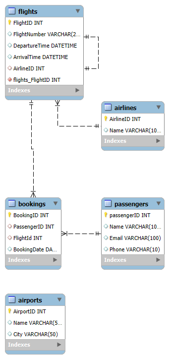

# ✈️ Flight Booking System - SQL Schema & ER Design

## 📌 Objective
Design and implement a normalized relational database for managing a flight booking system using MySQL.

## 🛠 Tools Used
- MySQL Workbench
- ER Diagram: Graphviz
- SQL: DDL (CREATE TABLE)

## 🗂 Entities
- **Passengers**: Stores passenger information
- **Airlines**: Stores airline names
- **Flights**: Details of flights including airline and schedule
- **Airports**: List of available airports
- **Bookings**: Records which passenger booked which flight

## 🔗 Relationships
- A Passenger can make multiple Bookings
- A Flight can be booked many times
- A Flight belongs to an Airline

## 📄 SQL Schema

```sql

create database flightsystem
use flightsystem

CREATE TABLE Passengers (
    PassengerID INT PRIMARY KEY AUTO_INCREMENT,
    Name VARCHAR(100),
    Email VARCHAR(100) UNIQUE,
    Phone VARCHAR(20)
);

CREATE TABLE Airlines (
    AirlineID INT PRIMARY KEY AUTO_INCREMENT,
    Name VARCHAR(100)
);

CREATE TABLE Flights (
    FlightID INT PRIMARY KEY AUTO_INCREMENT,
    FlightNumber VARCHAR(20),
    DepartureTime DATETIME,
    ArrivalTime DATETIME,
    AirlineID INT,
    FOREIGN KEY (AirlineID) REFERENCES Airlines(AirlineID)
);

CREATE TABLE Airports (
    AirportID INT PRIMARY KEY AUTO_INCREMENT,
    Name VARCHAR(100),
    City VARCHAR(100)
);

CREATE TABLE Bookings (
    BookingID INT PRIMARY KEY AUTO_INCREMENT,
    PassengerID INT,
    FlightID INT,
    BookingDate DATE,
    FOREIGN KEY (PassengerID) REFERENCES Passengers(PassengerID),
    FOREIGN KEY (FlightID) REFERENCES Flights(FlightID)
);
```

## 🖼 ER Diagram



## ✅ Outcome
A fully functional, normalized schema ready for flight booking operations with ER diagram and sample data.

---

